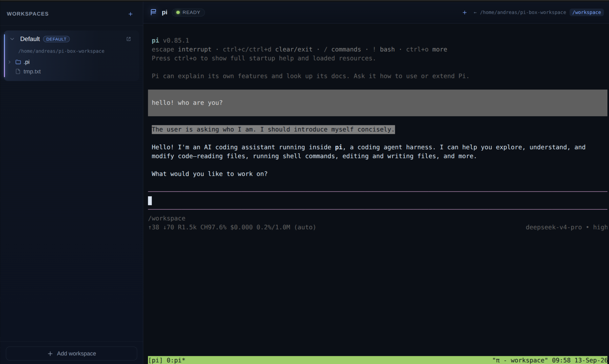

# pi-box



Native desktop app for macOS, Linux and Windows that wraps
[AgentVM](https://github.com/deepclause/agentvm) — a lightweight WASM-based
Alpine Linux VM with the **pi coding agent** installed — and gives you:

- a **terminal** that boots straight into the **pi coding agent** (inside tmux),
- **extra shell sessions** via tmux windows (a “new shell” button sends `Ctrl+B c`),
- **workspaces**: host folders that are mounted into the VM,
- a per-workspace **`.pi`** directory so pi's model config, credentials and
  sessions live in the workspace and survive reboots,
- a **file tree** view of each workspace,
- an **open in file manager** action (`open` / `xdg-open` / Explorer depending on OS).


> **Startup note:** booting to a shell is fast because the VM is snapshotted
> with Wizer, but launching `pi` itself (a Node/V8 process inside the emulated
> RISC-V VM) is currently slow — expect roughly a minute before the splash
> screen hands over to pi. We set `PI_OFFLINE=1` at startup so pi skips its
> slow network downloads (fd/ripgrep, catalog refresh), which keeps this as
> fast as possible.

---

## Design

### Framework choice

| Option | Verdict |
| --- | --- |
| **Electron** | ✅ chosen |
| Tauri | ❌ AgentVM is a Node.js library (`worker_threads`, `node:wasi`, `SharedArrayBuffer`); Tauri would need a sidecar Node process |
| Neutralino / others | ❌ less mature, weaker Node integration |

AgentVM runs in a Node **worker thread** and needs real Node built-ins
(`node:wasi`, `worker_threads`, `net`, `dgram`, `dns`). Electron's main process
*is* Node, so we can instantiate `AgentVM` directly with zero IPC plumbing to an
external runtime.

On top of Electron:

- **electron-vite** — build tooling for main/preload/renderer with HMR.
- **React + TypeScript** — UI.
- **@xterm/xterm + @xterm/addon-fit** — terminal emulator.
- No backend/server — renderer talks to the main process over Electron IPC.

### Process model

```
┌─────────────────────────── Electron ───────────────────────────┐
│                                                                │
│  main process (Node)          preload           renderer (React)│
│  ┌──────────────────┐   contextBridge/ipc    ┌───────────────┐  │
│  │ WorkspaceStore   │◄──────────────────────►│  Sidebar      │  │
│  │  workspaces.json │                        │  (tree view)  │  │
│  ├──────────────────┤                        ├───────────────┤  │
│  │ VmManager        │   pibox:output         │  TerminalView │  │
│  │  AgentVM worker  │◄──────────────────────►│  (xterm.js)   │  │
│  └──────────────────┘   pibox:termInput      └───────────────┘  │
└────────────────────────────────────────────────────────────────┘
```

- **`VmManager`** owns a single `AgentVM` instance in *interactive/raw mode*.
  `onStdout`/`onStderr` are forwarded to the renderer as decoded strings;
  keystrokes from xterm are written back with `vm.writeToStdin()`. Once the VM
  console shell is up, VmManager injects a startup script that starts a tiny
  **resize daemon** (applies the host-written `.pi/tty-size` via TIOCSWINSZ)
  and then launches **tmux** with `pi` in the first window. tmux handles
  terminal multiplexing natively, so extra shells are just new tmux windows
  (`Ctrl+B c`), and window resizes propagate to pi through tmux.
- **`WorkspaceStore`** persists workspaces to `<userData>/workspaces.json`,
  builds the file tree lazily per directory, and seeds each workspace with
  `.pi/settings.json`, `.pi/sessions/`, `.pi/tmux.conf` and
  `.pi/tty-resize-daemon.py`.
- The active workspace is mounted at **`/workspace`** inside the VM. Switching
  workspaces restarts the VM with the new mount (simple by design).

### Startup flow

1. App opens → **loading screen** with the DeepClause logo.
2. Main process boots `AgentVM` with the **last used workspace** mounted at
   `/workspace` (status: “Booting AgentVM…”).
3. When the shell prompt appears, the startup script launches tmux running `pi`
   (status: “Starting pi…”).
4. When pi's TUI has rendered (detected via its “Press ctrl+o” startup hint),
   the loading overlay disappears and the terminal shows pi inside tmux.

---

## Project structure

```
pi-box-app/
├── package.json
├── electron.vite.config.ts
├── tsconfig*.json
├── scripts/
│   └── ev.mjs                 # dev/preview launcher (sets NO_SANDBOX on Linux)
└── src/
    ├── shared/types.ts          # types shared across processes
    ├── main/
    │   ├── index.ts             # app bootstrap, window, VM wiring
    │   ├── vm.ts                # VmManager (AgentVM lifecycle)
    │   ├── workspaces.ts        # WorkspaceStore (persistence + tree)
    │   ├── ipc.ts               # IPC handlers
    │   └── agentvm.d.ts         # type declarations for deepclause-agentvm
    ├── preload/
    │   ├── index.ts             # contextBridge API (window.pibox)
    │   └── index.d.ts
    └── renderer/
        ├── index.html
        ├── public/logo.png      # DeepClause logo (loading screen)
        └── src/
            ├── App.tsx
            ├── styles.css
            └── components/
                ├── LoadingScreen.tsx
                ├── WorkspaceSidebar.tsx
                ├── FileTree.tsx
                └── TerminalView.tsx
```

---

## Development

Requirements: Node ≥ 22, npm.

```bash
cd pi-box-app
npm install
npm run dev
```

> The `deepclause-agentvm` dependency points at `file:../agentvm`, so the app
> uses the local AgentVM checkout (including its 320 MB
> `agentvm-alpine-python.wasm` image).

### Linux sandbox note

On Linux containers/CI the Chromium SUID sandbox helper is often not configured
(`chrome-sandbox` is not root:root mode 4755). `npm run dev` and `npm run start`
now set `NO_SANDBOX=1` **only on Linux** via `scripts/ev.mjs`, so Electron runs
with `--no-sandbox` there. macOS and Windows are unaffected.

If you prefer to run the raw commands, you can pass the flag manually:

```bash
npx electron-vite dev --noSandbox
```

### Useful scripts

```bash
npm run dev          # start with HMR
npm run build        # production build into out/
npm run start        # preview the production build
npm run typecheck    # type-check main + renderer
npm run dist:dir     # package an unpacked build locally (fast check)
npm run dist:linux   # build AppImage + deb
npm run dist:mac     # build dmg + zip (macOS only)
npm run dist:win     # build NSIS + portable (Windows only)
```

Release binaries are built by GitHub Actions on every published release — see
`.github/workflows/release.yml` and `docs/release-pipeline-proposal.md`.

---

## Implementation plan / roadmap

- [x] **v0.1 (this scaffold)** — loading screen, pi auto-start with splash
      until ready, per-workspace `.pi` (config + sessions), workspace list +
      lazy file tree, default workspace, add/remove/switch workspaces, open
      folder in OS file manager, last workspace restored on launch, extra shell
      sessions via tmux windows.
- [ ] **Packaging** — electron-builder for macOS (dmg), Windows (nsis) and
      Linux (AppImage/deb), bundling the wasm image.
- [ ] **PTY-backed terminal** — pi already runs inside tmux, which provides PTYs
      for its panes; further terminal polish (e.g. custom keybindings, richer
      status line) can build on that.
- [ ] **Per-file actions** — open/rename/delete in the tree, reveal in file
      manager.
- [ ] **Workspace settings UI** — edit `.pi/settings.json`, pick provider/model,
      manage sessions from the sidebar.
- [ ] **VM controls** — restart, network toggle, resource limits, boot logs.

## Known limitations

- pi runs inside tmux on the VM's serial console; tmux provides PTYs and
  `SIGWINCH` propagation for its panes.
- The AgentVM host mount is served over 9p/WASI, which has no `chmod` in WASI
  preview1: mode changes (`fs.chmod`/`fs.fchmod`) return `EPROTO` and creation
  mode bits are dropped. pi's auth save path is unaffected, but downloaded
  helper binaries (fd/ripgrep) and extension temp folders rely on chmod.
- First startup of a workspace may take longer while pi downloads its helper
  binaries (fd/ripgrep) into `.pi`; subsequent boots reuse the cache.
- Switching the active workspace restarts the VM (and therefore pi).
- The 320 MB wasm image must be read into memory on every boot (that's what the
  loading screen is for).
- AgentVM itself is experimental (see its README disclaimer).
