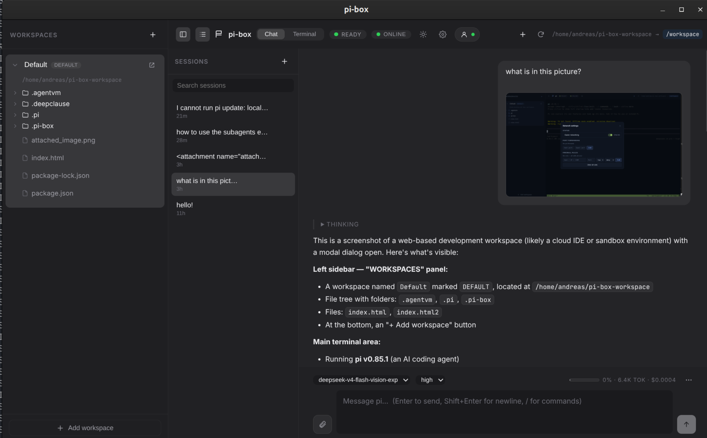
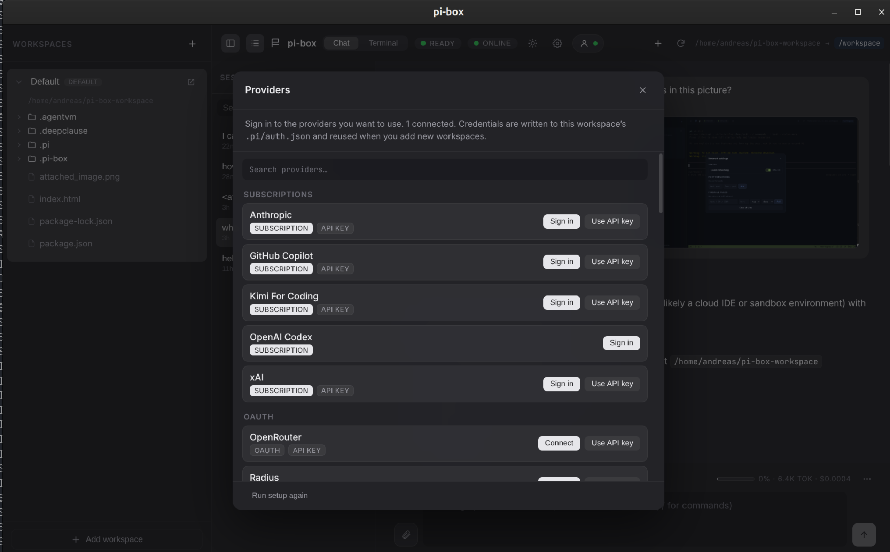
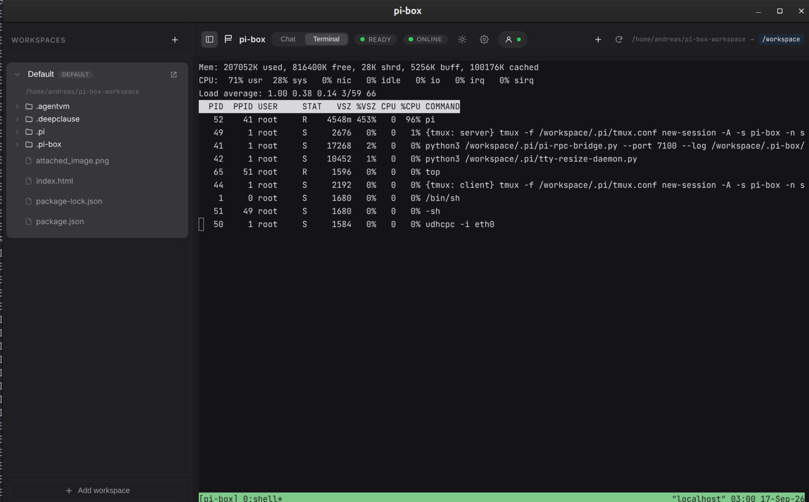
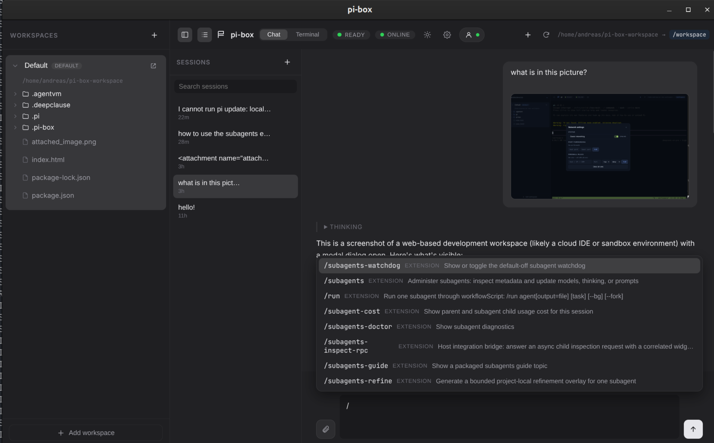
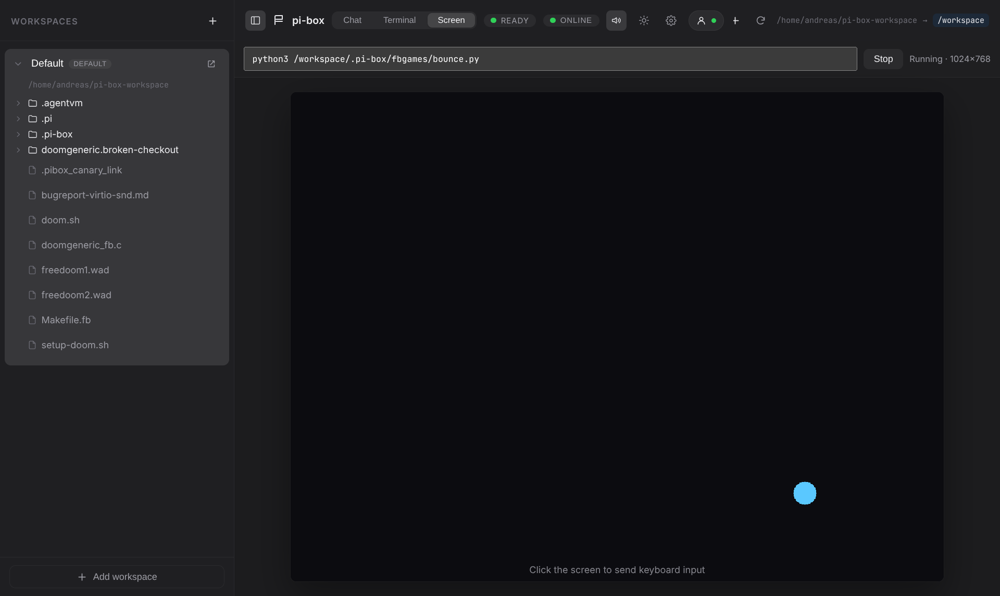
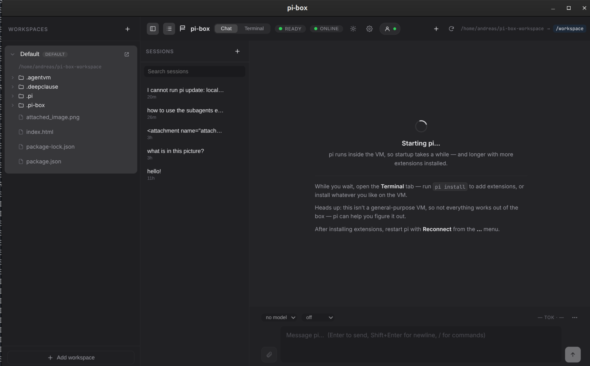

# pi-box



Native desktop app for macOS, Linux and Windows that wraps
[AgentVM](https://github.com/deepclause/agentvm) — a lightweight WASM-based
Alpine Linux VM with the **pi coding agent** installed — and gives you:

- a **chat UI** for pi (Claude-Desktop style): streaming replies, thinking
  blocks, live tool cards, model/thinking pickers, token & context stats,
  image **and file** attachments (PDF / text / docx / xlsx are copied into the
  workspace for pi to read), and a `/` command palette — driven by a headless
  `pi --mode rpc` process inside the VM,
- **native provider sign-in**: API keys and OAuth (Claude Pro/Max, GitHub
  Copilot, OpenAI Codex, …) handled in-app, written to the workspace's
  `.pi/auth.json`, with a first-run onboarding flow,
- **multiple pi sessions** per workspace (new, switch, rename, delete, fork,
  clone, export), listed in a sidebar and backed by the workspace's session files,
- a **terminal** (tmux) for real shells — run the pi **TUI**, `pi install` extra
  extensions, or anything else in the VM,
- a **Screen** tab that shows the VM's virtual framebuffer (`/dev/fb0`) and
  forwards your keyboard/mouse, so small games written for the VM are playable
  in-app (a `fbgame` helper and example games are seeded into each workspace),
- **guest audio** (virtio-snd) played through the app, with a mute toggle —
  games and other guest apps can make sound,
- **extra shell windows** via tmux (the “new shell” button sends `Ctrl+B c`),
- a full-featured **terminal**: truecolor, inline images (kitty protocol),
  clickable OSC 8 hyperlinks, and clipboard copy/paste (keyboard + right-click menu),
- **workspaces**: host folders that are mounted into the VM,
- a per-workspace **`.pi`** directory so pi's model config, credentials and
  sessions live in the workspace and survive reboots,
- a per-workspace **`.pi-box/config`** startup file for power users (extra env
  vars or a custom tmux config),
- a **file tree** view of each workspace, with a **per-file edit** action that
  opens the file in `vi` inside a new tmux window,
- an **open in file manager** action (`open` / `xdg-open` / Explorer depending on OS),
- a **collapsible workspaces sidebar** and a **restart** button in the terminal header,
- **network controls**: runtime on/off toggle, TCP **port forwarding**, and
  outbound **firewall rules** (via the gear menu in the terminal header),
- a **persistent root filesystem** per workspace, so guest-root changes (`apk add`,
  `/etc`, `/root`, `/tmp`, caches) survive restarts.


> **Startup note:** the VM boots to a shell quickly (snapshotted with Wizer),
> but starting `pi` inside the emulated RISC-V VM takes ~30 s, and **much longer
> with extensions installed** — pi transpiles TypeScript extensions at startup,
> and a large one can take minutes. The chat pane shows a “Starting pi…” state
> with tips while it boots, and the terminal is usable meanwhile. We set
> `PI_OFFLINE=1` so pi skips its startup network downloads (fd/ripgrep, catalog
> refresh).

## Screenshots

**Chat** — streaming replies, thinking blocks, tool cards, image & file attachments, and the session list.


**Providers** — sign in with a subscription or an API key; credentials live in the workspace.



**Terminal** — a real tmux shell inside the VM (install `pi` extensions or anything else).



**Commands** — the `/` palette lists extension, prompt and skill commands.



**Screen** — the VM's virtual framebuffer; small games render here and take keyboard input.



**First boot** — the VM comes up while the chat explains the wait.



## Download

[Latest release](https://github.com/deepclause/pi-box/releases/latest) · `v0.4.0`

- **macOS (Apple Silicon):** [pi-box-0.4.0-arm64.dmg](https://github.com/deepclause/pi-box/releases/download/v0.4.0/pi-box-0.4.0-arm64.dmg)
- **macOS (Intel):** [pi-box-0.4.0.dmg](https://github.com/deepclause/pi-box/releases/download/v0.4.0/pi-box-0.4.0.dmg)
- **Linux (AppImage):** [pi-box-0.4.0.AppImage](https://github.com/deepclause/pi-box/releases/download/v0.4.0/pi-box-0.4.0.AppImage)
- **Linux (deb):** [pi-box_0.4.0_amd64.deb](https://github.com/deepclause/pi-box/releases/download/v0.4.0/pi-box_0.4.0_amd64.deb)
- **Windows (installer):** [pi-box.Setup.0.4.0.exe](https://github.com/deepclause/pi-box/releases/download/v0.4.0/pi-box.Setup.0.4.0.exe)
- **Windows (portable):** [pi-box.0.4.0.exe](https://github.com/deepclause/pi-box/releases/download/v0.4.0/pi-box.0.4.0.exe)

> **macOS / Windows note:** these builds are **unsigned and not notarized**,
> and may still have issues (Gatekeeper prompts or odd errors). If a binary
> misbehaves, running from source is usually smoother:
>
> ```sh
> npm install
> npm run dev
> ```
>
> On macOS, if Gatekeeper blocks the app on first launch, you can also remove
> the quarantine attribute:
>
> ```sh
> xattr -dr com.apple.quarantine /Applications/pi-box.app
> ```
>
> (adjust the path if you moved the app elsewhere).

## Network & persistence

Built on `deepclause-agentvm` 0.4.0:

- **Network on/off** — toggle guest networking at runtime (header button or gear menu).
- **Port forwarding** — expose guest TCP servers on host ports; add/remove at runtime.
- **Firewall** — ordered outbound allow/deny rules, live-editable in the gear menu.
- **Persistent root filesystem** — a per-workspace ext4 overlay (guest-root changes
  like `apk add`, `/etc`, `/root`, `/tmp`, and pi's caches survive restarts). The
  overlay image lives at `<workspace>/.agentvm/upper.img`.

---

## Design

### Framework choice

| Option | Verdict |
| --- | --- |
| **Electron** | ✅ chosen |
| Tauri | ❌ AgentVM is a Node.js library (`worker_threads`, `node:wasi`, `SharedArrayBuffer`); Tauri would need a sidecar Node process |
| Neutralino / others | ❌ less mature, weaker Node integration |

AgentVM runs in a Node **worker thread** and needs real Node built-ins
(`node:wasi`, `worker_threads`, `net`, `dgram`, `dns`). Electron's main process
*is* Node, so we can instantiate `AgentVM` directly with zero IPC plumbing to an
external runtime.

On top of Electron:

- **electron-vite** — build tooling for main/preload/renderer with HMR.
- **React + TypeScript** — UI.
- **@xterm/xterm + @xterm/addon-fit + @xterm/addon-image** — terminal
  emulator (resize, inline images).
- No backend/server — renderer talks to the main process over Electron IPC.

### Process model

```
┌─────────────────────────── Electron ───────────────────────────┐
│                                                                │
│  main process (Node)          preload           renderer (React)│
│  ┌──────────────────┐   contextBridge/ipc    ┌───────────────┐  │
│  │ WorkspaceStore   │◄──────────────────────►│  Sidebar      │  │
│  │  workspaces.json │                        │  (tree view)  │  │
│  ├──────────────────┤                        ├───────────────┤  │
│  │ VmManager        │   pibox:output         │  TerminalView │  │
│  │  AgentVM worker  │◄──────────────────────►│  (xterm.js)   │  │
│  └──────────────────┘   pibox:termInput      └───────────────┘  │
└────────────────────────────────────────────────────────────────┘
```

- **`VmManager`** owns a single `AgentVM` instance in *interactive/raw mode*.
  `onStdout`/`onStderr` are forwarded to the renderer as decoded strings;
  keystrokes from xterm are written back with `vm.writeToStdin()`. Once the VM
  console shell is up, VmManager injects a startup script that sources the
  workspace's `.pi-box/config` (power-user env/tmux overrides), starts a tiny
  **resize daemon** (applies the host-written `.pi/tty-size` via TIOCSWINSZ)
  and then launches **tmux** with `pi` in the first window. tmux handles
  terminal multiplexing natively, so extra shells are just new tmux windows
  (`Ctrl+B c`), and window resizes propagate to pi through tmux.
- **`WorkspaceStore`** persists workspaces to `<userData>/workspaces.json`,
  builds the file tree lazily per directory, and seeds each workspace with
  `.pi/settings.json`, `.pi/sessions/`, `.pi/tmux.conf` and
  `.pi/tty-resize-daemon.py`.
- The active workspace is mounted at **`/workspace`** inside the VM. Switching
  workspaces restarts the VM with the new mount (simple by design).
- With **`persistentRoot`** enabled, AgentVM mounts an ext4-overlay root backed
  by `<workspace>/.agentvm/upper.img` before the startup script runs, so
  guest-root changes persist across restarts.

### Startup flow

1. App opens → **loading screen** with the DeepClause logo.
2. Main process boots `AgentVM` with the **last used workspace** mounted at
   `/workspace` (status: “Booting AgentVM…”). With persistence enabled,
   AgentVM mounts the ext4 overlay root first.
3. When the shell prompt appears, the startup script brings up the network,
   starts the guest RPC bridge (which warms a `pi --mode rpc` process), and
   launches tmux with a shell. The VM is marked ready shortly after, so the
   loading overlay clears quickly.
4. The chat view opens and connects to the bridge; while pi boots it shows a
   “Starting pi…” state, then renders the live transcript. The terminal tab is
   a tmux shell; the pi TUI is available from the header button.

---

## Project structure

```
pi-box-app/
├── package.json
├── electron.vite.config.ts
├── tsconfig*.json
├── scripts/
│   └── ev.mjs                 # dev/preview launcher (sets NO_SANDBOX on Linux)
└── src/
    ├── shared/types.ts          # types shared across processes
    ├── main/
    │   ├── index.ts             # app bootstrap, window, VM wiring
    │   ├── vm.ts                # VmManager (AgentVM lifecycle)
    │   ├── workspaces.ts        # WorkspaceStore (persistence + tree)
    │   ├── ipc.ts               # IPC handlers
    │   └── agentvm.d.ts         # type declarations for deepclause-agentvm
    ├── preload/
    │   ├── index.ts             # contextBridge API (window.pibox)
    │   └── index.d.ts
    └── renderer/
        ├── index.html
        ├── public/logo.png      # DeepClause logo (loading screen)
        └── src/
            ├── App.tsx
            ├── styles.css
            └── components/
                ├── LoadingScreen.tsx
                ├── NetworkSettings.tsx
                ├── WorkspaceSidebar.tsx
                ├── FileTree.tsx
                ├── icons.tsx
                └── TerminalView.tsx
```

---

## Development

Requirements: Node ≥ 22, npm.

```bash
cd pi-box-app
npm install
npm run dev
```

> `deepclause-agentvm` is an exact npm pin (currently `0.4.0`), so the app uses
> the published package (including its ~350 MB `agentvm-alpine-python.wasm`
> image).

### Linux sandbox note

On Linux containers/CI the Chromium SUID sandbox helper is often not configured
(`chrome-sandbox` is not root:root mode 4755). `npm run dev` and `npm run start`
now set `NO_SANDBOX=1` **only on Linux** via `scripts/ev.mjs`, so Electron runs
with `--no-sandbox` there. macOS and Windows are unaffected.

If you prefer to run the raw commands, you can pass the flag manually:

```bash
npx electron-vite dev --noSandbox
```

### Useful scripts

```bash
npm run dev          # start with HMR
npm run build        # production build into out/
npm run start        # preview the production build
npm run typecheck    # type-check main + renderer
npm run dist:dir     # package an unpacked build locally (fast check)
npm run dist:linux   # build AppImage + deb
npm run dist:mac     # build dmg + zip (macOS only)
npm run dist:win     # build NSIS + portable (Windows only)
```

Release binaries are built by GitHub Actions on every published release — see
`.github/workflows/release.yml` and `docs/release-pipeline-proposal.md`.

---

## Implementation plan / roadmap

- [x] **v0.1 scaffold** — loading screen, pi auto-start with splash until
      ready, per-workspace `.pi` (config + sessions), workspace list + lazy
      file tree, default workspace, add/remove/switch workspaces, open folder
      in OS file manager, last workspace restored on launch, extra shell
      sessions via tmux windows.
- [x] **Packaging** — electron-builder releases for macOS (dmg), Windows
      (nsis/portable) and Linux (AppImage/deb) via GitHub Actions.
- [x] **Terminal fidelity** — truecolor, inline images (kitty protocol), OSC 8
      hyperlinks, clipboard copy/paste, extended keys.
- [ ] **Per-file actions** — editing in `vi` is done; open/rename/delete in the
      tree are still pending.
- [x] **Provider auth** — native sign-in (API keys + OAuth), first-run
      onboarding, and credential management written to the workspace.
- [x] **File attachments** — images inline; PDF / text / docx / xlsx copied into
      the workspace and referenced for pi to read.
- [x] **Screen & audio** — the VM's virtual framebuffer (play small games in-app)
      and virtio-snd playback with a mute toggle.
- [ ] **Workspace settings UI** — edit `.pi/settings.json`, pick provider/model,
      manage sessions from the sidebar.
- [x] **VM controls** — restart button, network on/off toggle, TCP port
      forwarding, outbound firewall rules, and a persistent root filesystem.

## Known limitations

- The chat runs `pi --mode rpc` headless in the VM and reaches it over a guest
  TCP bridge exposed with AgentVM port forwarding (see
  `docs/pi-rpc-ui-design.md`). Starting pi takes ~30 s under emulation; the VM
  is single-hart, so run one pi process at a time (switching sessions reuses it).
- The terminal is tmux on the VM's serial console; tmux provides PTYs and
  `SIGWINCH` propagation for its panes.
- The AgentVM host mount is served over 9p/WASI, which has no `chmod` in WASI
  preview1 and drops creation mode bits. Since agentvm 0.3.3 the image accepts
  (no-ops) mode changes, so `chmod` no longer fails with `EPROTO`; the mode bits
  themselves are still not applied.
- pi runs with `PI_OFFLINE=1`, so it skips its startup network downloads; fd
  and ripgrep are therefore not downloaded by default (pi shows an offline
  warning) until offline mode is disabled.
- Switching the active workspace restarts the VM (and therefore pi).
- The ~322 MB wasm image must be read into memory on every boot (that's what the
  loading screen is for).
- AgentVM itself is experimental (see its README disclaimer).
- Persistence uses a 512 MB sparse ext4 overlay image per workspace
  (`<workspace>/.agentvm/upper.img`); the first boot of a workspace is slower
  because the guest formats it with `mkfs.ext4`.
